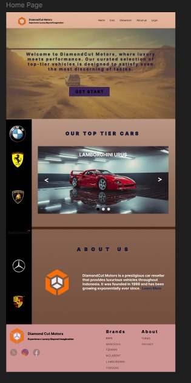

# Desain Website Showroom Mobil

Ini adalah desain untuk website showroom mobil yang dibuat menggunakan Figma. Desain ini mencakup berbagai halaman seperti Homepage, Cars, Showroom, About Us, Login, dan Register.

## Daftar Halaman
1. **Homepage** - Halaman utama website yang menyajikan informasi umum dan tampilan pertama bagi pengunjung.
2. **Cars** - Halaman yang menampilkan daftar mobil yang tersedia di showroom.
3. **Showroom** - Halaman yang berisi informasi tentang showroom dan berbagai layanan yang disediakan.
4. **About Us** - Halaman yang memberikan informasi tentang perusahaan atau tim yang mengelola showroom.
5. **Login** - Halaman login untuk pengguna yang ingin mengakses akun mereka.
6. **Register** - Halaman untuk registrasi akun baru bagi pengguna yang belum terdaftar.

## Fitur
- Desain UI/UX modern dan responsif
- Pengalaman pengguna yang ramah dan mudah dinavigasi
- Konsep halaman untuk showroom mobil lengkap dengan fitur login dan registrasi

## Screenshot
Berikut adalah beberapa screenshot dari desain yang ada di Figma:

## Cara Menjalankan
1. Unduh File "UI Design.fig"
2. Buka di aplikasi atau website figma

